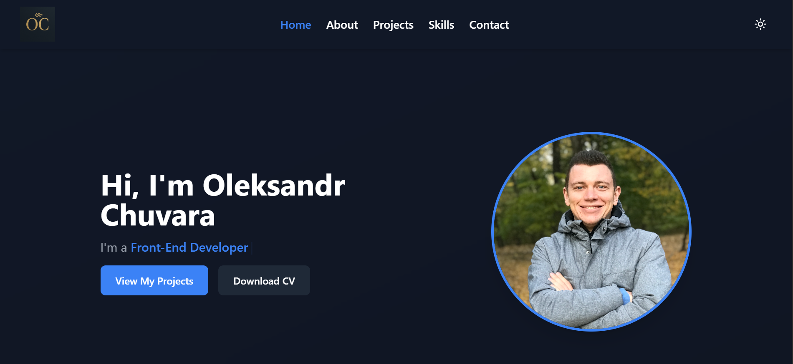

# 💼 Oleksandr Chuvara — Portfolio Website

This is my personal front-end developer portfolio website, built to showcase my skills, projects, and goals as I transition into the tech industry.

Visit it live: [https://alex-chuvara.com](https://alex-chuvara.com)

---

## 🧑‍💻 About Me

I'm Oleksandr Chuvara — a self-taught front-end developer originally from Ukraine, now based in the UK.  
Former hospitality manager now turning passion for web development into a full-time career.

---

## 🚀 Technologies Used

- **React.js**  
- **Vite**  
- **Tailwind CSS**  
- **Framer Motion**  
- **React Router DOM**  
- **Dark/Light Theme Switch (via Context API)**  
- **Responsive Design**  
- (Coming Soon: AI-powered “Know Me Better” chat section)

---

## 🛠️ Features

- ⚡ Fast & responsive layout  
- 🌙 Light/Dark mode with auto detection  
- 💬 Animated sections using Framer Motion  
- 🧠 Smart structure: Hero / About / Projects / Skills / Contact  
- 🖼️ Dynamic project cards with screenshots and hover effects

---

## 📷 Preview

 

---

## 📁 Folder Structure

src/
assets/
components/
context/
pages/
styles/
App.jsx
main.jsx

---

## 📬 Contact Me

Feel free to connect:

- Email: [alex.chuvara@gmail.com]
- LinkedIn: [linkedin.com/in/oleksandrchuvara](https://linkedin.com/in/oleksandrchuvara)

---

> Built with ❤️ using React + Tailwind + Framer Motion
